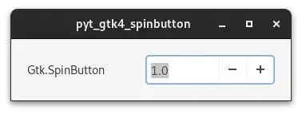

# pyt_gtk4_spinbutton

 

## 内容 

Gtk.SpinButtonを使用して、数値の選択をおこなうプログラムです。
uiの作成には、cambalacheを使用しています。

 

### Gtk.SpinButtonのプロパティ

| プロパティ | 内容 |
| --- | --- |
| adjustment | スピン ボタンの値を保持する調整。|
| climb-rate | ボタンまたはキーを押したときの加速率。 |
| digits | 表示する小数点以下の桁数。 |
| numeric | 数字以外の文字を無視するかどうか。 |
| snap-to-ticks | 誤った値がスピン ボタンの最も近いステップ増分に自動的に変更されるかどうか。 |
| update-policy | スピン ボタンを常に更新するか、値が許容される場合にのみ更新するかを指定。 |
| value | 現在の値。 |
| wrap | スピン ボタンが制限に達したときにラップするかどうか。|

### Gtk.SpinButtonのシグナル

| Signal | 内容 |
| --- | --- |
| activate | スピン ボタンがアクティブになったときに発行　※:Gtk4.14以降 |
| change-value | ユーザーが値の変更を開始したときに発行 |
| input | ユーザーの入力を double 値に変換するために発行 |
| output | 表示用の値の書式を微調整するために発行 |
| value-changed | 値が変更されたときに発行 |
| wrapped | スピンボタンが最大値から最小値へ、またはその逆へラップした直後に発行 |

 

## 履歴

2024/6/11 プログラム追加

 

## 参考にしたHP
